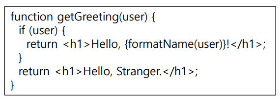

## JSX
JavaScript XML
#### JSX란?
  - XML 과 유사한 구문을 사용하여 DOM( 문서 개체 모델 ) 트리를 생성할 수 있는 JavaScript 확장
  - 구문상의 편의를 위해 JSX는 일반적으로 원래 JSX와 구조적으로 유사한 중첩된 JavaScript 함수 호출로 변환
  - 브라우저에서 실행하기 전에 바벨을 사용하여 일반 자바스크립트 형태의 코드로 변환된다.
  - JSX는 하나의 파일에 자바스크립트와 HTML을 동시에 작성하여 편리하다.
  - 자바스크립트에서 HTML을 작성하듯이 하기 때문에 가독성이 높고 작성하기 쉽다.
***
#### 1. 반드시 부모 요소 하나가 감싸는 형태여야 한다.
  - Virtual DOM에서 컴포넌트 변화를 감지할 때 효율적으 비교할 수 있도록 컴포넌트 내부는 하나의 DOM 트리 구조로 이루어져야 한다는 규칙이 있기 때문
  - 태그가 비어있다면 XML처럼 /> 를 이용해 바로 닫아주어야 한다.
  - JSX 태그는 자식을 포함할 수 있다.
  
  

#### 2. 자바스크립트 표현식
  - JSX 안에서도 자바스크립트 표현식을 사용할 수 있다.
  - 자바스크립트 표현식을 작성하려면 JSX내부에서 코드를 { }로 감싸주면 된다.
  - 유효한 모든 JavaScript 표현식을 넣을 수 있다.

  

#### 3. JSX도 표현식이다.
  - 컴파일이 끝나면, JSX 표현식이 JavaScript 객체로 인식된다.
  - 즉, JSX를 if 구문 및 for loop 안에 사용하고, 변수에 할당하고, 인자로서 받아들이고, 함수로부터 반환할 수 있다.
  - JSX는 자바스크립트 문법을 확장시킨 것, 따라서 모든 자바 스크립트 문법을 지원한다.
  - 자바스크립트에 추가로 XML과 HTML 섞어서 사용하면 된다
  - xml, html 코드를 사용 시 중간에 자바스크립트 코드를 사용하고 싶으면 중괄호 {}를 사용하여 묶어주면 된다.

  

#### 4. if문(for문) 대신 삼항 연산자(조건부 연산자) 사용
  

#### 5. JSX 속성 정의
  - 속성에 따옴표를 이용해 문자열 리터럴을 정의할 수 있다.
  - 속성에 중괄호를 이용해 자바스크립트 표현식을 포함시킬 수 있다.

#### 6. React DOM은 HTML 어트리뷰트 이름 대신 camelCase을 사용한다.
  - JSX에서 자바스크립트 문법을 쓰려면 {}를 써야 하기 때문에, 스타일을 적용할 때에도 객체 형태로 넣어 주어야 한다.
  - 카멜 표기법으로 작성해야 한다. (font-size => fontSize)

#### 7. 주석
  - JSX 내에서 {/*…*/} 와 같은 형식을 사용 한다.
  - 시작태그를 여러줄 작성시에는, 내부에서 // 의 형식을 사용할 수 있다.
## 실습
#### 자바스크립트 표현식
```
function App() {
  const name = 'GodDaeHee';
  return (
  <div>
    <div>Hello</div>
    <div>{name}!</div>
  </div>
  );
}
```

#### 삼항 연산자 사용
```
function App() {
  const loginYn = 'Y';
    return (
      <>
        <div>
          {loginYn === 'Y' ? (
            <div>GodDaeHee 입니다.</div>
          ) : (
            <div>비회원 입니다.</div>
          )}
        </div>
      </>
    );
  }

```

#### JSX 스타일링
```
function App() {
  const style = {
    backgroundColor: 'green',
    fontSize: '12px'
  }
  return (
    <div style={style}>Hello, GodDaeHee!</div>
  );
}
```

#### 간단한 React 컴포넌트 예
```
import React from 'react';

function App() {
  const name = 'John Doe';
  const items = ['Apple', 'Banana', 'Cherry'];

  return (
    <div className="App">
      <h1>Hello, {name}!</h1>
      <p className="intro">This is an introduction paragraph.</p>

      <ul>
        {items.map((item, index) => <li key={index}>{item}</li>)}
      </ul>

      <button onClick={() => { alert('Button is clicked!'); }}>
        Click me
      </button>

      <input type="text" placeholder="Enter some text" />

      
    </div>
  );
}

export default App;
```

#### book
Book.js
```
import React from "react";

function Book(props){
    return (
        <div>
            <h1>{`이 책의 이름은 ${props.name}입니다.`}</h1>
            <h2>{`이 책의 총 ${props.numberOfpage}페이지로 이뤄져 있습니다.`}</h2>
        </div>
    );
}
export default Book;
```
BookLibrary.js
```
import React from "react";
import Book from "./book";

function BookLibrary(props){
    return (
        <div>
            <Book name="처음 만난 React" numberOfpage={300} />
            <Book name="처음 만난 JSX" numberOfpage={400} />
            <Book name="처음 만난 Component" numberOfpage={500} />
        </div>
    );
}
export default BookLibrary;
```
index.js
```
import React from 'react';
import ReactDOM from 'react-dom/client';
import './index.css';
import reportWebVitals from './reportWebVitals';
import BookLibrary from './jsxCode/BookLibrary';

const root = ReactDOM.createRoot(document.getElementById('root'));
root.render(
  <React.StrictMode>
    <BookLibrary />
  </React.StrictMode>
);

// If you want to start measuring performance in your app, pass a function
// to log results (for example: reportWebVitals(console.log))
// or send to an analytics endpoint. Learn more: https://bit.ly/CRA-vitals
reportWebVitals();
```

#### 간단한 시계
```
<!DOCTYPE html>
<html>
<head>
<title>new document</title>
<meta http-equiv="content-type" content="text/html;charset=utf-8" />
</head>
<script type="text/javascript">
<!--
setInterval("dpTime()", 1000);
function dpTime() {
    var now = new Date();
    hours = now.getHours();
    minutes = now.getMinutes();
    seconds = now.getSeconds();
    if (hours > 12) {
    hours -= 12;
    ampm = "오후 ";
    } else {
    ampm = "오전 ";
    }
    if (hours < 10) {
    hours = "0" + hours;
    }
    if (minutes < 10) {
    minutes = "0" + minutes;
    }
    if (seconds < 10) {
    seconds = "0" + seconds;
    }
    document.getElementById("dpTime").innerHTML =
    ampm + hours + ":" + minutes + ":" + seconds;
}
//-->
</script>
<span id="dpTime">오후 01:44:40</span>
<body>
</body>
</html>
```

#### 바이너리 시계
```
<!DOCTYPE html>
<html>
<head>
<meta charset="utf-8">
<script src="https://unpkg.com/react@15/dist/react.min.js"></script>
<script src="https://unpkg.com/react-dom@15/dist/react-dom.min.js"></script>
<script src="https://cdnjs.cloudflare.com/ajax/libs/babel-core/5.8.38/browser.min.js"></script>
<style> body { font-size:32px; text-align:center; } </style>
</head>
<body>
<div><div id="disp"></div></div>
<script type="text/babel">
// 정기적으로 화면을 변경하게 지정합니다.
setInterval(update, 1000)
// 정기적으로 실행되는 함수입니다.
function update () {
    // 현재 시간을 이진 숫자로 변환합니다. ---- (※1)
    const now = new Date();
    const hh = z2(now.getHours())
    const mm = z2(now.getMinutes())
    const ss = z2(now.getSeconds())
    const binStr = hh + mm + ss
    const style0 = { color: 'brown' }
    const style1 = { color: 'red'}
    const lines = []
    for (let i = 0; i < binStr.length; i++) {
        const v = parseInt(binStr.substr(i, 1))
        const bin = "0000" + v.toString(2)
        const bin8 = bin.substr(bin.length - 4, 4)
        // 이진 숫자를 구성하는 리액트 객체를 lines 배열에 추가합니다. --- (※2)
        for (let j = 0; j < bin8.length; j++) {
            if (bin8.substr(j, 1) === '0') {
            lines.push(<span style={style0}>○</span>)
            } else {
            lines.push(<span style={style1}>●</span>)
            }
            }
            lines.push(<br />)
    }
    // DOM의 내용을 변경합니다. --- (※3)
    const disp = document.getElementById('disp')
    ReactDOM.render(<div>{lines}</div>, disp)
}
function z2 (v) {
    v = String("00" + v)
    return v.substr(v.length - 2, 2)
}
</script>
</body>
</html>
```


