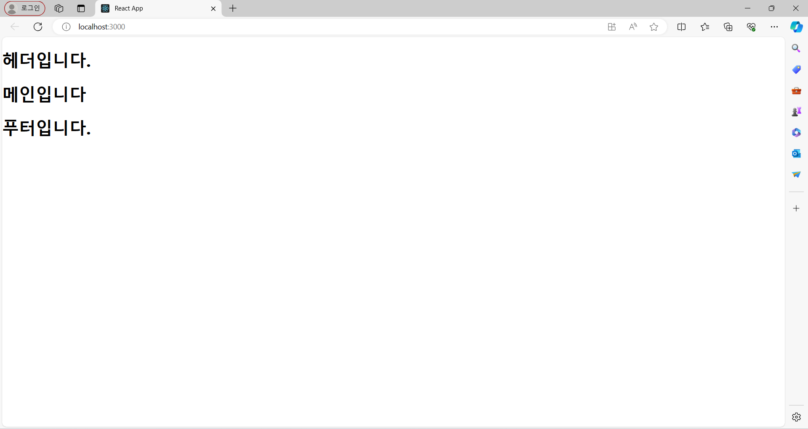
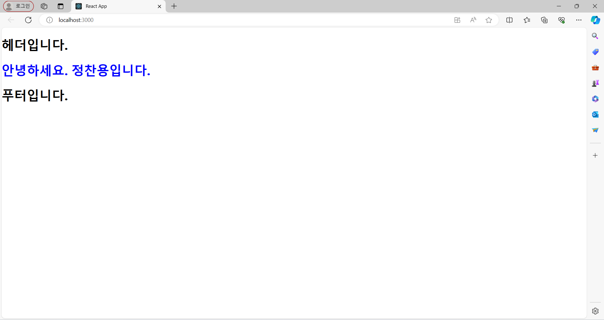
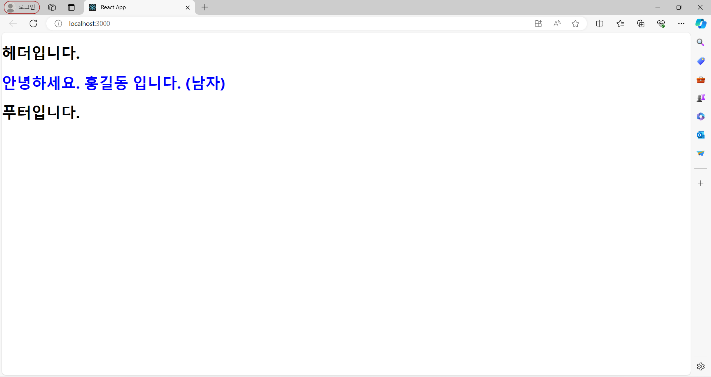
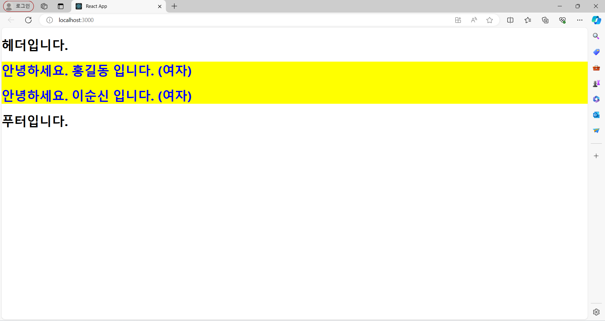
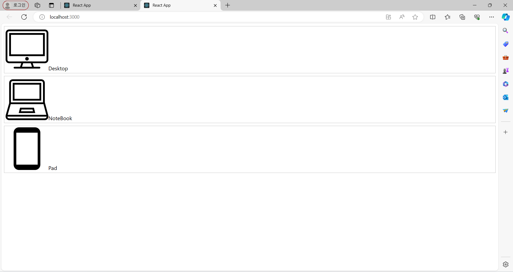
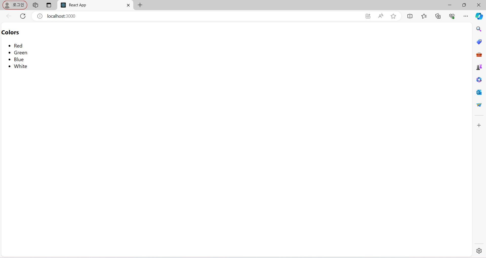
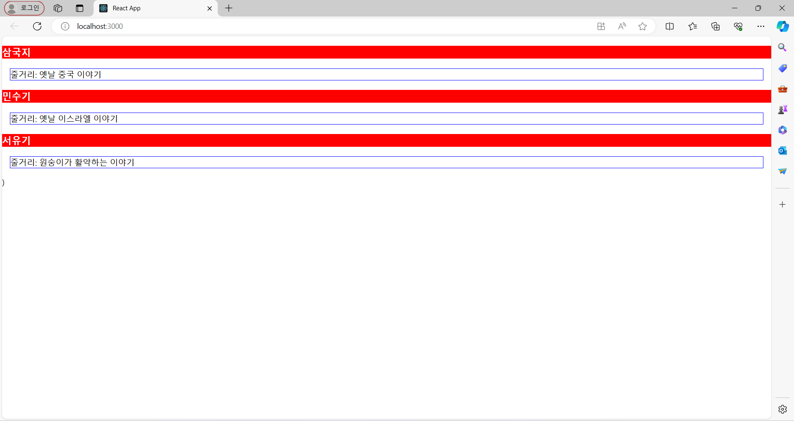
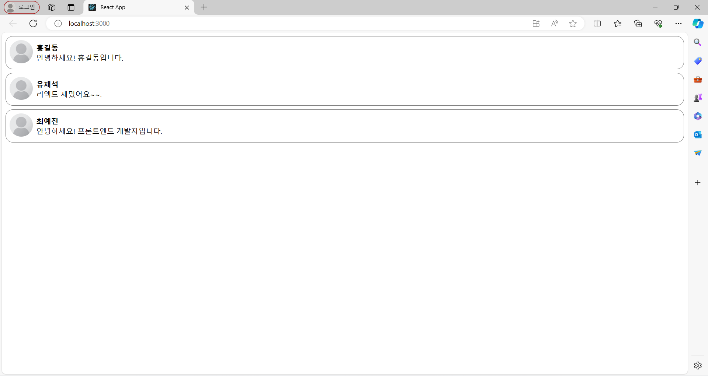

## Component

#### 정의
입력(props)을 받아 출력(Element) 하는 역할

#### 장점
1. 코드 양을 줄일 수 있다.
2. 개발 시간을 줄일 수 있다.
3. 유지 보수 비용이 줄어든다.

#### Coponent란?
-  리액트는 Component 기반의 구조라는 특징을 가지고 있다.
- 리액트는 모든 페이지가 Component로 구성되어 있고 하나의 Component는 또 다른 여러 개의 Component의 조합으로 구성될 수 있다.

#### 리엑트 컴포넌트
-  결국 React Component가 해주는 역할은 어떠한 속성들을 입력으로 받아서 그에 맞는 React Element를 생성하여 리턴해 주는 것이다.
- React Component를 만들고자 하는 대로 props, 즉 속성을 넣으면 해당 속성에 맞춰 화면에 나타날 Element를 만들어준다.
## Props

#### 프로퍼티(속성)
- 프로퍼티, props(properties의 줄임말)이다.
- 상위 컴포넌트가 하위 컴포넌트에 값을 전달할때 사용한다.
- 프로퍼티는 수정할 수 없다는 픅징이 있다.
- React 컴포넌트느 props를 이용햇 서로 통신한다.
- 모든 부모 컴포넌트는 props를 줌으로써 몇몇의 정보를 자식 컴포넌트에게 전달할 수 있다.

## 실습
Header.js

```
import React from 'react'

export default function Header() {
    return (
        <div>
            <header>
                <h1>헤더입니다.</h1>
            </header>
        </div>
    )
}
```

Footer.js

```
import React from 'react'

export default function Footer() {
    return (
        <div>
            <footer>
                <h1>푸터입니다.</h1>
            </footer>
        </div>
    )
}
```

#### comp
Main.js

```
import React from 'react'

export default function Main(props) {
    return (
        <div>
            <main>
                <h1>메인입니다</h1>
            </main>
        </div>
    )
}
```

App.js

```
import Header from './Header';
import Main from './Main';
import Footer from './Footer';

function App() {
  return (
    <>
        <Header/>
        <Main/>
        <Footer/>
    </>
  );
}

export default App;
```



#### props
Main.js
```
import React from 'react'

export default function Main(props) {
    return (
        <div>
            <main>
                <h1 style={{color: props.color}}> 안녕하세요. {props.name}입니다.</h1>
            </main>
        </div>
    )
}
```

App.js
```
import Header from './Header';
import Main from './Main';
import Footer from './Footer';

function App() {
  return (
    <>
        <Header/>
        <Main/>
        <Footer/>
    </>
  );
}

export default App;

```



#### Boolean props
Main.js
```
import React from 'react'

export default function Main({color, name, maleYn}) {
    const msg = maleYn ? '남자' : '여자'; // 불리언 사용
    return (
        <div>
            <main>
            <h1 style={{color}}>안녕하세요. {name} 입니다. ({msg})</h1>
            </main>
        </div>
    )
}
```

App.js
```
import Header from './Header';
import Main from './Main';
import Footer from './Footer';

function App() {
  return (
    <>
        <Header/>
        <Main name="홍길동" color="blue" maleYn/>
        <Footer/>
    </>
  );
}

export default App;

```


#### props.children 활용
Wrapper.js
```
import React from 'react';
function Wrapper(props) {
    const style = {
    backgroundColor: 'yellow',
    };
    return (
        <div style={style}>
            {props.children}
        </div>
    );
}
export default Wrapper;
```

App.js
```
import Header from './Header';
import Main from './Main';
import Footer from './Footer';
import Wrapper from './Wrapper';

function App() {
  return (
    <>
        <Header/>
        <Wrapper>
            <Main name="홍길동" color="blue"/>
            <Main name="이순신" color="blue"/>
        </Wrapper>
        <Footer/>
    </>
  );
}

export default App;
```



#### 이미지
FPhotoText.js

```
import React from 'react'

export default function FPhotoText(props) {
    const url ="images/"+props.image+".png";
    const label = props.label;
    const boxStyle = {
        border: "1px solid silver",
        margin: "8px",
        padding: "4px"
    }
    return (
        <div style={boxStyle}>
            
            <span>{label}</span>
        </div>
    )
}
```

App.js
```
import FPhotoText from './FPhotoText';

function App() {
  return (
    <>
        <FPhotoText image="Desktop" label = "Desktop" />
        <FPhotoText image="Notebook" label = "NoteBook" />
        <FPhotoText image="Phone" label = "Pad" />
    </>
  );
}

export default App;
```



#### 리스트 컴포넌트
RList.js
```
import React, { Component } from 'react'

export default class RList extends Component {
    render() {
        const items = this.props.items.split(",")
        const itemsObj = items.map(
        (e) => {
            return <li>{e}</li>
        })
        let title = this.props.title
        if (!title) title = "LIST"
        return (
            <div>
                <h3>{title}</h3>
                <ul>{itemsObj}</ul>
            </div>
        )
    }
}
```

App.js
```
import './App.css';
import RList from './RList';
function App() {
    return (
        <div>
        <RList title="Colors" items="Red,Green,Blue,White" />
        </div>
    );
}
export default App;

```



#### 화살표 함수
index.js
```
import React from "react";
import ReactDOM from "react-dom/client";
import "./index.css";
import reportWebVitals from "./reportWebVitals";
const root = ReactDOM.createRoot(document.getElementById("root"));
// 화살표 함수로 컴포넌트를 정의합니다.
const TitleParts = (props) => (
  <div style={{ backgroundColor: "red", color: "white" }}>
    <h3>{props.title}</h3>
  </div>
);
const ContentParts = (props) => (
  <div style={{ border: "1px solid blue", margin: 15 }}>
    <div>줄거리: {props.body}</div>
  </div>
);
// 메인 컴포넌트
const Book = (props) => (
  <div>
    <TitleParts title={props.title} />
    <ContentParts body={props.body} />
  </div>
);
root.render(
  <React.StrictMode>
    <div>
      <Book title="삼국지" body="옛날 중국 이야기" />
      <Book title="민수기" body="옛날 이스라엘 이야기" />
      <Book title="서유기" body="원숭이가 활약하는 이야기" />
    </div>
  </React.StrictMode>
);
reportWebVitals();
```



#### 댓글컴포넌트 만들기
Index.js

```
import React from "react";
import ReactDOM from "react-dom/client";
import "./index.css";
import CommentList from "./CommentList";
import reportWebVitals from "./reportWebVitals";
const root = ReactDOM.createRoot(document.getElementById("root"));
root.render(
  <React.StrictMode>
    <CommentList />
  </React.StrictMode>
);
```

Comment.js

```
import React from "react";
const styles = {
    wrapper: {
        margin: 8,
        padding: 8,
        display: "flex",
        flexDirection: "row",
        border: "1px solid grey",
        borderRadius: 16,
    },
    imageContainer: {},
    image: {
        width: 50,
        height: 50,
        borderRadius: 25,
    },
    contentContainer: {
        marginLeft: 8,
        display: "flex",
        flexDirection: "column",
        justifyContent: "center",
    },
    nameText: {
        color: "black",
        fontsize: 16,
        fontWeight: "bold",
    },
    commentText: {
        color: "black",
        fontSize: 16,
    },
    };

function Comment(props) {
    return (
        <div style={styles.wrapper}>
        <div style={styles.imageContainer}>
            
        </div>
        <div style={styles.contentContainer}>
            <span style={styles.nameText}>{props.name}</span>
            <span style={styles.commentText}>{props.comment}</span>
        </div>
        </div>
    );
}
export default Comment;
```

CommentList.js

```
import React from "react";
import Comment from "./Comment";
const comments = [
    {
        name: "홍길동",
        comment: "안녕하세요! 홍길동입니다.",
    },
    {
        name: "유재석",
        comment: "리액트 재밌어요~~.",
    },
    {
        name: "최예진",
        comment: "안녕하세요! 프론트엔드 개발자입니다.",
    },
];
    function CommentList(props) {
    return (
        <div>
        {comments.map((comment) => {
            return <Comment name={comment.name} comment={comment.comment} />;
        })}
        </div>
    );
}
export default CommentList;
```


