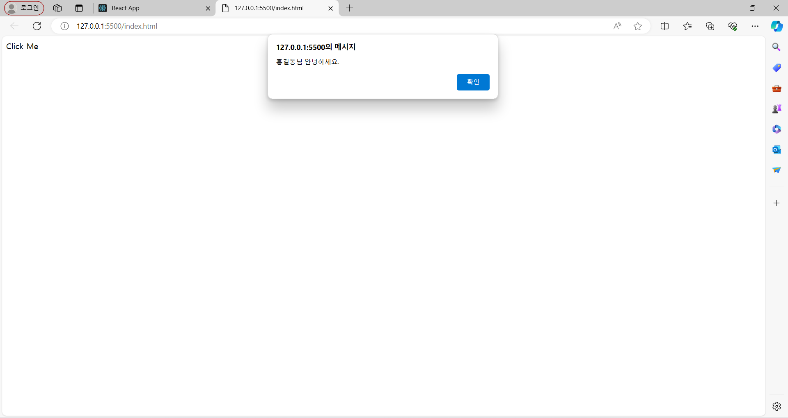

## state
- state는 간단하게 말해서 변수이다. 하지만 const, let 등으로 선언한 변수와 다르게 값이 변하면 관련 있는 컴포넌트들이 재렌더링되어 화면이 바뀐다.
- state는 컴포넌트의 내부에서 변경 가능한 데이터를 다루기 위해 사용하는 객체이다.
- 값을 저장하거나 변경할 수 있는 객체로 보통 이벤트와 함께 사용된다.
- 개발자가 의도한 동작에 의해 변할 수도 있고 사용자의 입력에 따라 새로운 값으로 변경될 수도 있다.
- State 값이 변경되고 재 렌더링이 필요한 경우에 React가 자동으로 계산하여 변경된 부분을 렌더링 한다.
- State란 랜더링 결과물에 영향을 주는 정보
- state는 상태라는 뜻을 가지고 있다.
- 상태라는 단어가 정상, 비정상을 나타내는 것이라기보다 리액트 Component의 데이터라는 의미가 더 가깝다.
- 이 state는 사전에 미리 정해진 것이 아니라 React Component를 개발하는 각 개발자가 직접 정의해서 사용한다.
- State를 정의할 때 중요한 점은 꼭 렌더링이나. 데이터 흐름에 사용되는 것만 state에 사용해야 한다.
- 컴포넌트의 메모리
- 모든 컴포넌트에 state를 추가하고 업데이트를 할 수 있다.
상태(state).
- state는 Component 내부에서 관리하며, 상태에 따라 변하는 동적 데이터 이다.
- state는 props와 다르게 자동으로 생성되지 않아 명시적으로 state 를 기술 해야 한다..
- 이 값은 컴포넌트가 렌더링되는 동안 변할 수 있으며, 변경될 때마다 컴포넌트가 다시 렌더링된다.
- 함수 컴포넌트에서 내부적으로 상태를 관리해야 하는 일이 필요하다. 이를 위해 필요한 것이 state다
## setState
#### 동작
1. setState를 통해 state의 값을 변경해주고,
2. React가 state의 변경을 감지하면
3. 화면을 리렌더링해준다
#### sestState는 비동기적으로 작동한다.
- setState는 비동기적으로 동작하는데, setState 바로 아래에 console.log로 count를 출력해 봤을 때 확인
할 수 있다.
- 분명히 setCount로 count를 변경했는데, 변경한 후에 console.log로 찍어보니 값이 바로 바뀌지 않는다.

- 그 이유는 setState가 비동기이기 때문이다.
- 동기(Synchronous : 동시에 발생하는)
    - 요청을 보냈다면, 응답을 받아야 다음 동작이 이루어진다.
    - 순차적으로 실행되기 때문에, 어떤 작업이 수행 중이라면 다음 작업은 대기해야 한다.
    - 블로킹(작업 중단)이 발생한다.
- 비동기(Asynchronous : 동시에 발생하지 않는)
    - 작업 종료 여부에 관계없이 다음 작업을 실행한다.
    - 그러므로 동기 방식과는 달리 실행 순서를 보장하지 않는다.
    - 블로킹이 발생하지 않는다.
- setCount는 이벤트 핸들러 안에서 현재 state의 값에 대한 변화를 요청하기만 하는 것이라서 이벤트 핸
들러가 끝나고 리액트가 상태를 바꾸고 화면을 다시 그리기를 기다려야 한다.
#### 컴포넌트에서 DOM 이벤트 사용
- 컴포넌트에서 출력된 특정 DOM 객체에 이벤트 컴포넌트가 동작하기 위해선 DOM이벤트 프로퍼티를 사용해야 한다.
- 우리가 흔히 쓰고 있는 HTML 엘리먼트의 이벤트들은 JSX내에서 'on + 이벤트명' 형태의 프로퍼티로 제공된다.

## 실습
#### 비동기 Counter
```
export default function Counter() {
    const [number, setNumber] = useState(0);
    return (
        <>
        <h1>{number}</h1>
        <button
            onClick={() => {
            setNumber(number + 1);
            console.log(number);
            setNumber(number + 2);
            console.log(number);
            setNumber(number + 3);
            console.log(number);
            }}
        >
            +3
        </button>
        </>
    );
}
```

#### 해결법
```
export default function Counter() {
    const [number, setNumber] = useState(0);
    return (
        <>
        <h1>{number}</h1>
        <button
            onClick={() => {
            setNumber((number) => number + 1);
            console.log(number);
            setNumber((number) => number + 2);
            console.log(number);
            setNumber((number) => number + 3);
            console.log(number);
            }}
        >
            +3
        </button>
        </>
    );
}
```

#### State
```
import React from "react";
export default class App extends React.Component {
  constructor(props) {
    super(props);
    this.state = {
      name: "홍길동",
      age: 300,
      job: "developer",
    };
  }
  render() {
    const { name, age, job } = this.state;
    return (
      <div style={{ margin: 15 }}>
        <div>name: {name}</div>
        <div>age: {age}</div>
        <div>job: {job}</div>
      </div>
    );
  }
}
```

#### Counter
```
import React, { Component } from "react";
class Counter extends Component {
    constructor(props) {
        super(props);
        // state 초기값 설정
        this.state = {
        count: 0,
        };
    }
    render() {
        const { count } = this.state;
        return (
        <div>
            <h2>현재 Count : {count}</h2>
            <button
            onClick={() => {
                this.setState({ count: count + 1 });
            }}
            >
            카운트 +1
            </button>
        </div>
        );
    }
}
export default Counter;
```

#### 리엑트 이벤트 문법
```
import React, { useState } from "react";
const Main = () => {
    const [myName, setMyName] = useState("홍길동");
    function changeName() {
        setMyName(myName === "홍길동" ? "김길동" : "홍길동");
    }
    return (
        <div>
        <h1>안녕하세요. {myName} 입니다.</h1>
        <button onClick={changeName}>Change</button>
        </div>
    );
};
export default Main;
```
|
---|---
#### 너비,높이 증가
```
import { useState } from "react";
const Area = () => {
    const [size, setSize] = useState({ width: 200, height: 100 });
    return (
        <div>
        <h1>
            너비 : {size.width}, 높이 : {size.height}
        </h1>
        <button
            onClick={() => {
            const copy = { ...size };
            copy.width += 20;
            setSize(copy);
            }}
        >
            너비 증가
        </button>
        <button
            onClick={() => {
            const copy = { ...size };
            copy.height += 10;
            setSize(copy);
            }}
        >
            높이 증가
        </button>
        </div>
    );
};
export default Area;
```

#### 경고창
```
<!DOCTYPE html>
<html>

<head>
    <meta charset="utf-8" />
    <script src="https://unpkg.com/react@15/dist/react.min.js"></script>
    <script src="https://unpkg.com/react-dom@15/dist/react-dom.min.js"></script>
    <script src="https://cdnjs.cloudflare.com/ajax/libs/babel-core/5.8.38/browser.min.js"></script>
</head>

<body>
    <div id="root"></div>
    <script type="text/babel">
        // 컴포넌트를 정의합니다.
        class Hello extends React.Component {
            constructor(props) {
                super(props);
                // 이벤트 핸들러의 this를 설정합니다. --- (※1)
                this.clickHandler = this.clickHandler.bind(this);
            }
            clickHandler(e) {
                const name = this.props.name;
                window.alert(`${name}님 안녕하세요.`);
            }
            render() {
                // 클릭 이벤트를 지정합니다. --- (※2)
                return <div onClick={this.clickHandler}>Click Me</div>;
            }
        }
        // 컴포넌트를 사용합니다.
        ReactDOM.render(<Hello name="홍길동" />, document.getElementById("root"));
    </script>
</body>

</html>
```

### 체크박스 구현
```
<!DOCTYPE html>
<html>

<head>
    <meta charset="utf-8" />
    <script src="https://unpkg.com/react@15/dist/react.min.js"></script>
    <script src="https://unpkg.com/react-dom@15/dist/react-dom.min.js"></script>
    <script src="https://cdnjs.cloudflare.com/ajax/libs/babel-core/5.8.38/browser.min.js"></script>
</head>

<body>
    <div id="root"></div>
    <script type="text/babel">
        // 상태를 가진 컴포넌트를 정의합니다.
        class CBox extends React.Component {
            // 생성자
            constructor(props) {
                super(props);
                // 상태를 초기화합니다.
                this.state = { checked: false };
            }
            render() {
                // 체크되지 않았을 때의 상태
                let mark = "□";
                let bstyle = { fontWeight: "normal" };
                // 체크돼 있는지 확인합니다.
                if (this.state.checked) {
                    mark = "■";
                    bstyle = { fontWeight: "bold" };
                }
                // 클릭했을 때의 이벤트를 지정합니다.
                const clickHandler = (e) => {
                    const newValue = !this.state.checked;
                    this.setState({ checked: newValue });
                };
                // 렌더링할 내용을 반환합니다.
                return (
                    <div onClick={clickHandler} style={bstyle}>
                        {mark} {this.props.label}
                    </div>
                );
            }
        }
        // 리액트로 DOM의 내용을 변경합니다.
        const dom = (
            <div>
                <CBox label="Apple" />
                <CBox label="Banana" />
                <CBox label="Orange" />
                <CBox label="Mango" />
            </div>
        );
        ReactDOM.render(dom, document.getElementById("root"));
    </script>
</body>

</html>
```
|
---|---
#### 스톱워치 만들기
```
import React, { Component } from 'react'
import './Stopwatch.css';
// Stopwatch 컴포넌트를 정의합니다.
class Stopwatch extends Component {
constructor (props) {
super(props)
this.state = { // 초깃값을 설정합니다.
isLive: false,
curTime: 0,
startTime: 0
}
this.timerId = 0
}
// 마운트했을 때
componentWillMount () {
this.timerId = setInterval(e => {
this.tick()
}, 1000)
}
// 언마운트했을 때
componentWillUnmount () {
clearInterval(this.timerId)
}
// 매 초 실행됩니다.
tick () {
    if (this.state.isLive) {
    const v = new Date().getTime()
    this.setState({curTime: v})
    }
    }
    // 시작/중지 버튼을 클릭했을 때
    clickHandler (e) {
    // 중지할 때
    if (this.state.isLive) {
    this.setState({isLive: false})
    return
    }
    // 시작할 때
    const v = new Date().getTime()
    this.setState({
    curTime: v,
    startTime: v,
    isLive: true})
    };
// 출력할 시계를 생성합니다.
getDisp () {
    const s = this.state
    const delta = s.curTime - s.startTime
    const t = Math.floor(delta / 1000)
    const ss = t % 60
    const m = Math.floor(t / 60)
    const mm = m % 60
    const hh = Math.floor(mm / 60)
    const z = (num) => {
    const s = '00' + String(num)
    return s.substr(s.length - 2, 2)
    }
    return <span className='disp'>
    {z(hh)}:{z(mm)}:{z(ss)}
    </span>
    }
// 화면 렌더링
render () {
    let label = 'START'
    if (this.state.isLive) {
    label = 'STOP'
    }
    const disp = this.getDisp()
    const fclick = (e) => this.clickHandler(e)
    return (<div className='Stopwatch'>
    <div>{disp}</div>
    <button onClick={fclick}>{label}</button>
    </div>)
    }
    }
export default Stopwatch
```

#### 간단한 입력 양식 만들기
```
import React from "react";
// 입력 양식 컴포넌트입니다.
export class SimpleForm extends React.Component {
    constructor(props) {
        super(props);
        // 상태를 초기화합니다.
        this.state = { value: "" };
    }
    // 값이 변경됐을 때
    doChange(e) {
        const newValue = e.target.value;
        this.setState({ value: newValue });
    }
    // 전송 버튼을 눌렀을 때
    doSubmit(e) {
        window.alert("전송: " + this.state.value);
        e.preventDefault();
    }
    // 화면 렌더링
    render() {
        // 이벤트를 메서드에 바인딩합니다.
        const doSubmit = (e) => this.doSubmit(e);
        const doChange = (e) => this.doChange(e);
        return (
        <form onSubmit={doSubmit}>
            <input type="text" value={this.state.value} onChange={doChange} />
            <input type="submit" value="전송" />
        </form>
        );
    }
}
```

#### 숫자만 입력받는 텍스트박스 만들기
```
import React, { Component } from "react";
// 숫자 입력 컴포넌트
export default class NumberForm extends Component {
    constructor(props) {
        super(props);
        this.state = { value: "" };
    }
    // 값이 변경됐을 때
    doChange(e) {
        const curValue = e.target.value;
        // 숫자 이외의 값을 제거합니다.
        const newValue = curValue.replace(/[^0-9]/g, "");
        this.setState({ value: newValue });
    }
    // 전송 버튼을 눌렀을 때
    doSubmit(e) {
        window.alert("전송: " + this.state.value);
        e.preventDefault();
    }
    // 화면 렌더링
    render() {
        // 이벤트를 메서드에 바인딩합니다.
        const doSubmit = (e) => this.doSubmit(e);
        const doChange = (e) => this.doChange(e);
        return (
        <form onSubmit={doSubmit}>
            <input type="text" value={this.state.value} onChange={doChange} />
            <input type="submit" value="전송" />
        </form>
        );
    }
}
```

#### 여러 개의 입력 항목을 가진 입력 양식 만들기
```
import React, { Component } from "react";
import './MultiForm.css'
// 여러 개의 입력 항목을 가진 컴포넌트
export default class MultiForm extends Component {
    constructor(props) {
        super(props);
        // 입력 양식의 초깃값을 설정합니다.
        this.state = {
        name: "홍길동",
        age: 300,
        hobby: "개발",
        };
    }
    // 값이 변경됐을 때
    doChange(e) {
        const userValue = e.target.value;
        const key = e.target.name;
        this.setState({ [key]: userValue });
    }
    // 전송 버튼을 눌렀을 때
    doSubmit(e) {
        e.preventDefault();
        const j = JSON.stringify(this.state);
        window.alert(j);
    }
    // 화면 렌더링
    render() {
        // 이벤트를 메서드에 바인딩합니다.
        const doSubmit = (e) => this.doSubmit(e);
        const doChange = (e) => this.doChange(e);
        return (
        <form onSubmit={doSubmit}>
            <div>
            <label>
                이름: <br />
                <input
                name="name"
                type="text"
                value={this.state.name}
                onChange={doChange}
                />
            </label>
            </div>
            <div>
            <label>
                나이: <br />
                <input
                name="age"
                type="number"
                value={this.state.age}
                onChange={doChange}
                />
            </label>
            </div>
            <div>
            <label>
                취미: <br />
                <input
                name="hobby"
                type="text"
                value={this.state.hobby}
                onChange={doChange}
                />
            </label>
            </div>
            <input type="submit" value="전송" />
        </form>
        );
    }
}
```
