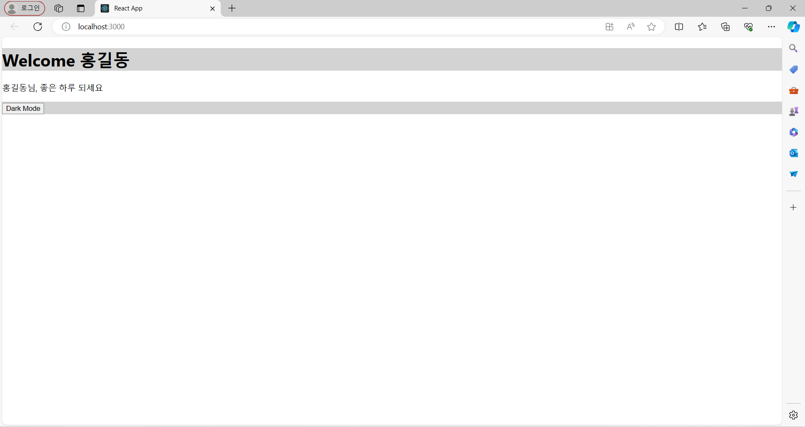
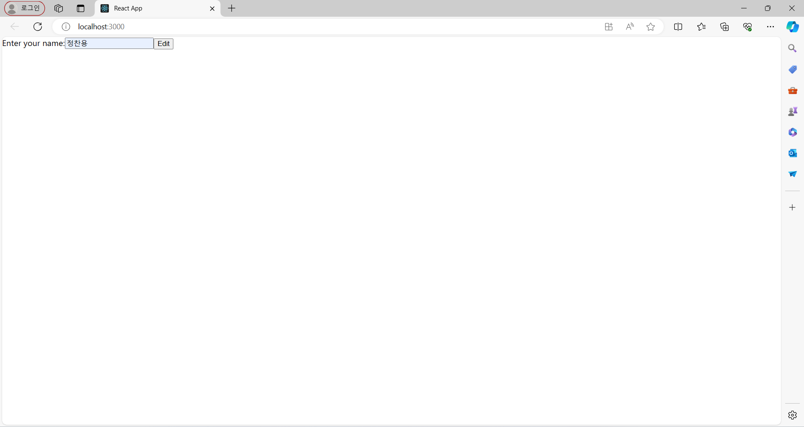
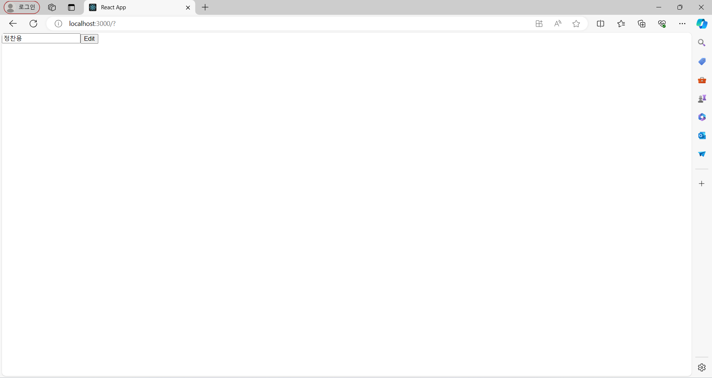

## Hook
#### useReducer
```
import React, { useState } from "react";
const Counter = ({ initialCount }) => {
    const initial = initialCount ? initialCount : 0;
    const [count, setCount] = useState(initial);
    const onIncrease = () => {
        setCount((count) => count + 1);
    };
    const onDecrease = () => {
        setCount((count) => count - 1);
    };
    return (
        <>
        <h2>Count: {count}</h2>
        <button onClick={() => setCount(initial)}>초기화</button>
        <button onClick={onIncrease}>증가</button>
        <button onClick={onDecrease}>감소</button>
        </>
    );
};
export default Counter;
```


#### useContext
Header.js
```
import { useContext } from "react";
import { ThemeContext } from "./ThemeContext";
const Header = () => {
    const { isDark } = useContext(ThemeContext);
    return (
        <header
        className="header"
        style={{
            backgroundColor: isDark ? "black" : "lightgray",
            color: isDark ? "white" : "black",
        }}
        >
        <h1>Welcome 홍길동!</h1>
        </header>
    );
};
export default Header;

```
content.js
```
import React, { useContext } from "react";
import { ThemeContext } from "./ThemeContext";
const Content = () => {
    const { isDark } = useContext(ThemeContext);
    return (
        <div
        className="content"
        style={{
            backgroundColor: isDark ? "black" : "white",
            color: isDark ? "white" : "black",
        }}
        >
        <p>홍길동님, 좋은 하루 되세요 </p>
        </div>
    );
};
export default Content;
```
Footer.js
```
import React, { useContext } from "react";
import { ThemeContext } from "./ThemeContext";
const Footer = () => {
    const { isDark, setIsDark } = useContext(ThemeContext);
    const toggleTheme = () => {
        setIsDark(!isDark);
    };
    return (
        <footer
        className="footer"
        style={{ backgroundColor: isDark ? "black" : "lightgray" }}
        >
        <button className="button" onClick={toggleTheme}>
            Dark Mode
        </button>
        </footer>
    );
};
export default Footer;

```
page.js
```
import React from "react";
import Content from "./Content";
import Header from "./Header";
import Footer from "./Footer";
const Page = () => {
    return (
        <div className="page">
        <Header />
        <Content />
        <Footer />
        </div>
    );
};
export default Page;
```
ThemeContext.js
```
import { createContext } from "react";
export const ThemeContext = createContext(null);
```
App.js
```
import { useState } from "react";
import "./App.css";
import Page from "./Page";
import { ThemeContext } from "./ThemeContext";
function App() {
  const [isDark, setIsDark] = useState(false);
  return (
    <ThemeContext.Provider value={{ isDark, setIsDark }}>
      <Page />
    </ThemeContext.Provider>
  );
}
export default App;

```

|
---|---

#### useRef
```
import React, { useState, useRef } from "react";
const InputSample = () => {
    const [inputs, setInputs] = useState({
        이름: "",
        nickname: "",
    });
    const nameFocus = useRef();
    const { 이름, nickname } = inputs;
    const onChange = (e) => {
        const { value, name } = e.target;
        setInputs({
        ...inputs,
        [name]: value,
        });
    };
    const onReset = () => {
        setInputs({
        이름: "",
        nickname: "",
        });
        nameFocus.current.focus();
    };
    return (
        <div>
        <input
            name="이름"
            placeholder="이름쓰세요"
            onChange={onChange}
            value={이름}
            ref={nameFocus}
        />
        <input
            name="nickname"
            placeholder="닉네임쓰세요"
            onChange={onChange}
            value={nickname}
        />
        <button onClick={onReset}>초기화</button>
        <div>
            <b>값:</b>
            {이름}({nickname})
        </div>
        </div>
    );
};
export default InputSample;
```


#### forwardRef
```
import { useRef } from "react";
import { forwardRef } from "react";

const MyInput = forwardRef(function MyInput(props, ref) {
    const { label, ...otherProps } = props;
    return (
        <label>
        {label}
        <input {...otherProps} ref={ref} />
        </label>
    );
});

function Form() {
    const ref = useRef(null);
    function handleClick() {
        ref.current.focus();
    }
    return (
        <form>
        <MyInput label="Enter your name:" ref={ref} />
        <button type="button" onClick={handleClick}>
            Edit
        </button>
        </form>
    );
}

export default Form;
```



#### useImperativeHandle
MyInput.js
```
import { useRef, useImperativeHandle } from 'react';
function MyInput(props, ref) {
    const inputRef = useRef(null);
    useImperativeHandle(
        ref,
        () => {
        return {
            focus() {
            inputRef.current.focus();
            },
        };
        },
        []
    );
    return <input type="text" ref={inputRef} />;
}
export default MyInput;
```
Form.js
```
import { useRef,forwardRef } from 'react';
import MyInput from './MyInput';
const ForwardedMyInput = forwardRef(MyInput);
function Form() {
    const ref = useRef(null);
    function handleClick() {
        ref.current.focus();
    }
    return (
        <form>
        <ForwardedMyInput ref={ref} />
        <button type="button" onClick={handleClick}>
            Edit
        </button>
        </form>
    );
}
export default Form;
```



#### useEffect
```
import { useEffect, useState } from "react";
export default function UseEffectTest() {
    const [count, setCount] = useState(1000);
    useEffect(() => {
        console.log("useEffect");
        const interval = setInterval(() => console.log(count), count);
        return () => {
        clearInterval(interval);
        console.log("clearInterval");
        };
    }, [count]);
    const countHandler = (e) => {
        setCount((c) => c + 1000);
    };
    return (
        <div className="App">
        <h1>{count}</h1>
        <button onClick={countHandler}>카운트 증가</button>
        </div>
    );
}
```


#### useMemo
```
```

#### useCallback
```
```

#### useTransition
```
```

#### UseId
```
```
