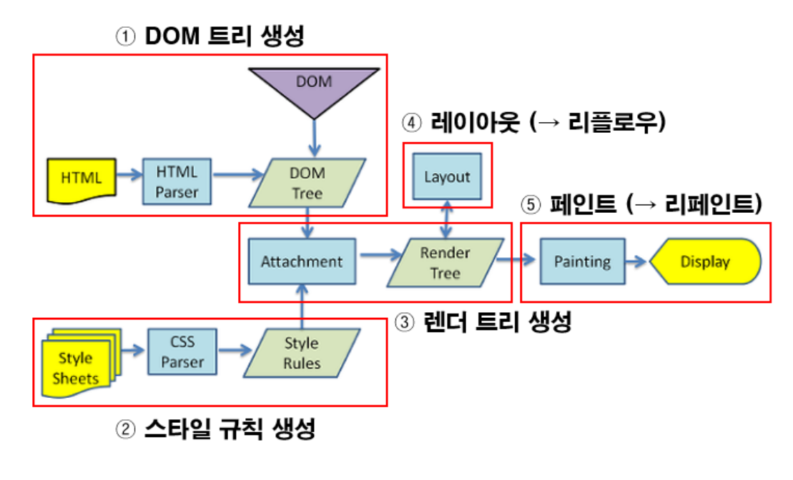
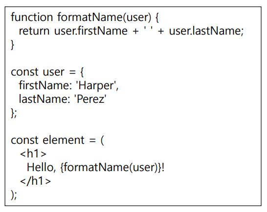
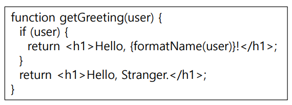
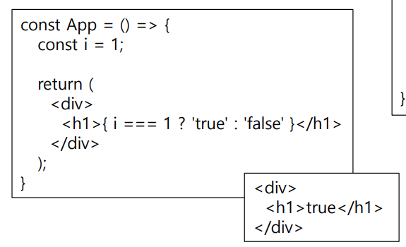
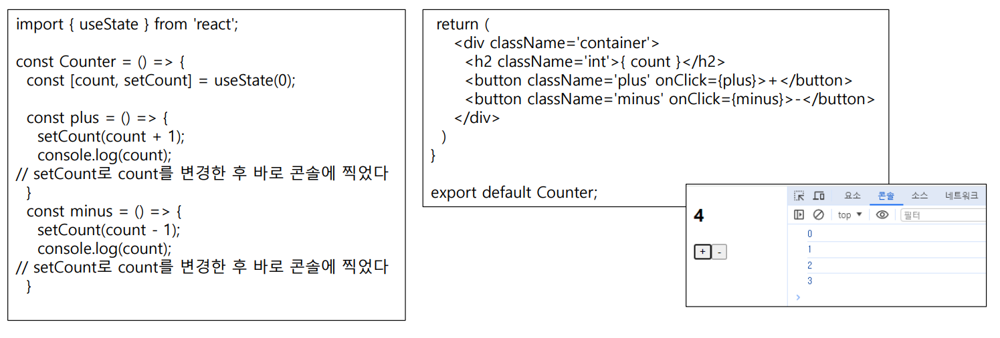
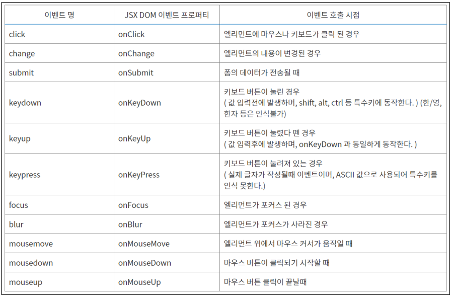

# 0315
## DOM
  Document Object Model

  HTML 태그가 출력된 모양이나 콘텐츠를 제어하기 위해 웹 페이지에 작성된 HTML 태그 당 객체(DOM 객체) 생성
  
#### 구성
  - 프로퍼티(property)
  - 메소드(method)
  - 컬렉션(collection)
  - 이벤트 리스너(event listener)
  - CSS3 스타일

## Randering
#### 과정
  - HTML을 파싱하여 DOM 트리를 만든다. 
  - CSS를 파싱하여 CSSOM 트리를 만든다.
  - DOM 과 CSSOM 을 결합하여 렌더링 트리를 만든다.
  - 렌더링 트리에서 각 노드의 크기와 위치를 계산한다.
  - 개별 노드를 화면에 그린다.

## SPA vs MPA
 SPA(Single Page Application)
 - 한 개(Single)의 Page로 구성된 Application.
 - 새로운 페이지 요청이 있을 때 필요 데이터만 받아 갱신.
 - 서버로부터 완전한 새로운 페이지를 불러오지 않고 현재의 페이지를 동적으로 다시 작성.
 - SPA는 보통 CSR(Client Side Rendering)방식으로 렌더링.

  MPA(Multi Page Application)
  - 여러 개(Multiple)의 Page로 구성된 Application.
  - 새로운 페이지를 요청할 때마다 서버에서 렌더링된 정적리소스가(HTML, CSS, JS)가 다운로드.
  - 페이지를 이동하거나 새로고침하면 전체 페이지를 다시 렌더링.
  - MPA는 SSR(Server Side Application)방식으로 렌더링.

#### 정리
    SPA는 페이지가 바뀔 때마다 페이지를 서버로부터 새로운 페이지를 불러오지 않아도 돼서 전체를 다시 렌더링할 필요가 없다.

***
# 0322
## React
#### 리엑트란?
  - 사용자 인터페이스를 만들기 위한 JavaScript 라이브러리
  - SPA(Single Page Application) 개발을 위한 프레임워크
  - 사용자와 웹 사이트의 상호작용을 돕는 인터페이스를 만들기 위한 자바스크립트 기능 모음집
  - 가상 DOM(Document object model)과 JSX(JavaScript XML) 방식으로 동작하는 프레임워크
#### 리엑트의 장점
  - 완성도 높고 이해하기 쉬운 개발 워크플로우
  - 뛰어난 유연성과 호환성
  - 손쉬운 컴포넌트 재사용성
  - Virtual DOM으로 한층 강화된 고성능
  - Flux와 Redux의 힘
  - 다양한 툴 제공
  - React Native의 강력한 기능
  - 시장에 영향을 미치는 거대한 커뮤니티와 리소스
  - HTML 확장을 위한 JSX 구문
  - React Hook 
#### Virtual DOM
  
  뷰(HTML)에 변화가 있을 때, 구 가상돔과 새 가상돔을  비교하여 변경된 내용만 DOM에 적용한다. 이를 통해 브라우저 내에서 발생하는 렌더링 과정을 줄이면서 성능이 개선되는 것 이다.

# 0329
## JSX
JavaScript XML
#### JSX란?
  - XML 과 유사한 구문을 사용하여 DOM( 문서 개체 모델 ) 트리를 생성할 수 있는 JavaScript 확장
  - 구문상의 편의를 위해 JSX는 일반적으로 원래 JSX와 구조적으로 유사한 중첩된 JavaScript 함수 호출로 변환
  - 브라우저에서 실행하기 전에 바벨을 사용하여 일반 자바스크립트 형태의 코드로 변환된다.
  - JSX는 하나의 파일에 자바스크립트와 HTML을 동시에 작성하여 편리하다.
  - 자바스크립트에서 HTML을 작성하듯이 하기 때문에 가독성이 높고 작성하기 쉽다.
***
#### 1. 반드시 부모 요소 하나가 감싸는 형태여야 한다.
  - Virtual DOM에서 컴포넌트 변화를 감지할 때 효율적으 비교할 수 있도록 컴포넌트 내부는 하나의 DOM 트리 구조로 이루어져야 한다는 규칙이 있기 때문
  - 태그가 비어있다면 XML처럼 /> 를 이용해 바로 닫아주어야 한다.
  - JSX 태그는 자식을 포함할 수 있다.
  
  

#### 2. 자바스크립트 표현식
  - JSX 안에서도 자바스크립트 표현식을 사용할 수 있다.
  - 자바스크립트 표현식을 작성하려면 JSX내부에서 코드를 { }로 감싸주면 된다.
  - 유효한 모든 JavaScript 표현식을 넣을 수 있다.

  

#### 3. JSX도 표현식이다.
  - 컴파일이 끝나면, JSX 표현식이 JavaScript 객체로 인식된다.
  - 즉, JSX를 if 구문 및 for loop 안에 사용하고, 변수에 할당하고, 인자로서 받아들이고, 함수로부터 반환할 수 있다.
  - JSX는 자바스크립트 문법을 확장시킨 것, 따라서 모든 자바 스크립트 문법을 지원한다.
  - 자바스크립트에 추가로 XML과 HTML 섞어서 사용하면 된다
  - xml, html 코드를 사용 시 중간에 자바스크립트 코드를 사용하고 싶으면 중괄호 {}를 사용하여 묶어주면 된다.

  

#### 4. if문(for문) 대신 삼항 연산자(조건부 연산자) 사용
  

#### 5. JSX 속성 정의
  - 속성에 따옴표를 이용해 문자열 리터럴을 정의할 수 있다.
  - 속성에 중괄호를 이용해 자바스크립트 표현식을 포함시킬 수 있다.

#### 6. React DOM은 HTML 어트리뷰트 이름 대신 camelCase을 사용한다.
  - JSX에서 자바스크립트 문법을 쓰려면 {}를 써야 하기 때문에, 스타일을 적용할 때에도 객체 형태로 넣어 주어야 한다.
  - 카멜 표기법으로 작성해야 한다. (font-size => fontSize)

#### 7. 주석
  - JSX 내에서 {/*…*/} 와 같은 형식을 사용 한다.
  - 시작태그를 여러줄 작성시에는, 내부에서 // 의 형식을 사용할 수 있다.

# 0405
## Component
#### 정의
    입력(props)을 받아 출력(Element) 하는 역할
#### 장점
    1. 코드 양을 줄일 수 있다.
    2. 개발 시간을 줄일 수 있다.
    3. 유지 보수 비용이 줄어든다.
#### Coponent란?
-  리액트는 Component 기반의 구조라는 특징을 가지고 있다.
- 리액트는 모든 페이지가 Component로 구성되어 있고 하나의 Component는 또 다른 여러 개의 Component의 조합으로 구성될 수 있다.
#### 리엑트 컴포넌트
-  결국 React Component가 해주는 역할은 어떠한 속성들을 입력으로 받아서 그에 맞는 React Element를 생성하여 리턴해 주는 것이다.
- React Component를 만들고자 하는 대로 props, 즉 속성을 넣으면 해당 속성에 맞춰 화면에 나타날 Element를 만들어준다.
## Props
#### 프로퍼티(속성)
- 프로퍼티, props(properties의 줄임말)이다.
- 상위 컴포넌트가 하위 컴포넌트에 값을 전달할때 사용한다.
- 프로퍼티는 수정할 수 없다는 픅징이 있다.
- React 컴포넌트느 props를 이용햇 서로 통신한다.
- 모든 부모 컴포넌트는 props를 줌으로써 몇몇의 정보를 자식 컴포넌트에게 전달할 수 있다.
# 0412
## state
- state는 간단하게 말해서 변수이다. 하지만 const, let 등으로 선언한 변수와 다르게 값이 변하면 관련 있는 컴포넌트들이 재렌더링되어 화면이 바뀐다.
- state는 컴포넌트의 내부에서 변경 가능한 데이터를 다루기 위해 사용하는 객체이다.
- 값을 저장하거나 변경할 수 있는 객체로 보통 이벤트와 함께 사용된다.
- 개발자가 의도한 동작에 의해 변할 수도 있고 사용자의 입력에 따라 새로운 값으로 변경될 수도 있다.
- State 값이 변경되고 재 렌더링이 필요한 경우에 React가 자동으로 계산하여 변경된 부분을 렌더링 한다.
- State란 랜더링 결과물에 영향을 주는 정보
- state는 상태라는 뜻을 가지고 있다.
- 상태라는 단어가 정상, 비정상을 나타내는 것이라기보다 리액트 Component의 데이터라는 의미가 더 가깝다.
- 이 state는 사전에 미리 정해진 것이 아니라 React Component를 개발하는 각 개발자가 직접 정의해서 사용한다.
- State를 정의할 때 중요한 점은 꼭 렌더링이나. 데이터 흐름에 사용되는 것만 state에 사용해야 한다.
- 컴포넌트의 메모리
- 모든 컴포넌트에 state를 추가하고 업데이트를 할 수 있다.
상태(state).
- state는 Component 내부에서 관리하며, 상태에 따라 변하는 동적 데이터 이다.
- state는 props와 다르게 자동으로 생성되지 않아 명시적으로 state 를 기술 해야 한다..
- 이 값은 컴포넌트가 렌더링되는 동안 변할 수 있으며, 변경될 때마다 컴포넌트가 다시 렌더링된다.
- 함수 컴포넌트에서 내부적으로 상태를 관리해야 하는 일이 필요하다. 이를 위해 필요한 것이 state다
## setState
#### 동작
1. setState를 통해 state의 값을 변경해주고,
2. React가 state의 변경을 감지하면
3. 화면을 리렌더링해준다
#### sestState는 비동기적으로 작동한다.
- setState는 비동기적으로 동작하는데, setState 바로 아래에 console.log로 count를 출력해 봤을 때 확인
할 수 있다.
- 분명히 setCount로 count를 변경했는데, 변경한 후에 console.log로 찍어보니 값이 바로 바뀌지 않는다.

- 그 이유는 setState가 비동기이기 때문이다.
- 동기(Synchronous : 동시에 발생하는)
    - 요청을 보냈다면, 응답을 받아야 다음 동작이 이루어진다.
    - 순차적으로 실행되기 때문에, 어떤 작업이 수행 중이라면 다음 작업은 대기해야 한다.
    - 블로킹(작업 중단)이 발생한다.
- 비동기(Asynchronous : 동시에 발생하지 않는)
    - 작업 종료 여부에 관계없이 다음 작업을 실행한다.
    - 그러므로 동기 방식과는 달리 실행 순서를 보장하지 않는다.
    - 블로킹이 발생하지 않는다.
- setCount는 이벤트 핸들러 안에서 현재 state의 값에 대한 변화를 요청하기만 하는 것이라서 이벤트 핸
들러가 끝나고 리액트가 상태를 바꾸고 화면을 다시 그리기를 기다려야 한다.
#### 컴포넌트에서 DOM 이벤트 사용
- 컴포넌트에서 출력된 특정 DOM 객체에 이벤트 컴포넌트가 동작하기 위해선 DOM이벤트 프로퍼티를 사용해야 한다.
- 우리가 흔히 쓰고 있는 HTML 엘리먼트의 이벤트들은 JSX내에서 'on + 이벤트명' 형태의 프로퍼티로 제공된다.

# 0419
